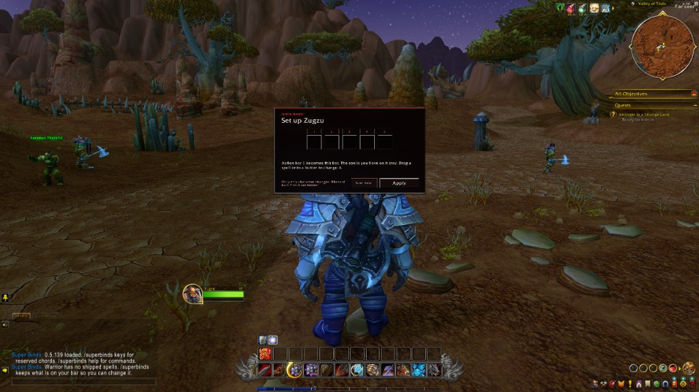
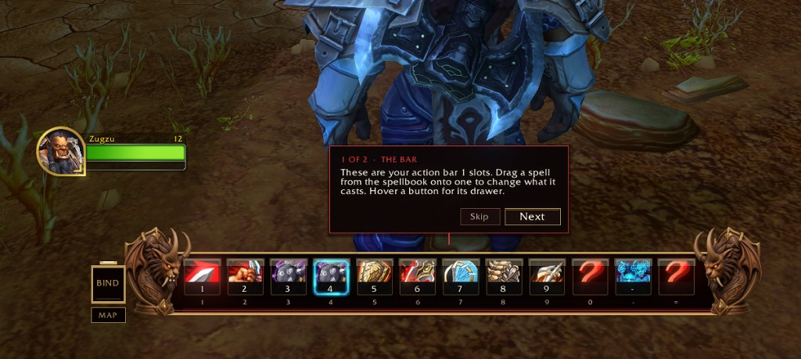
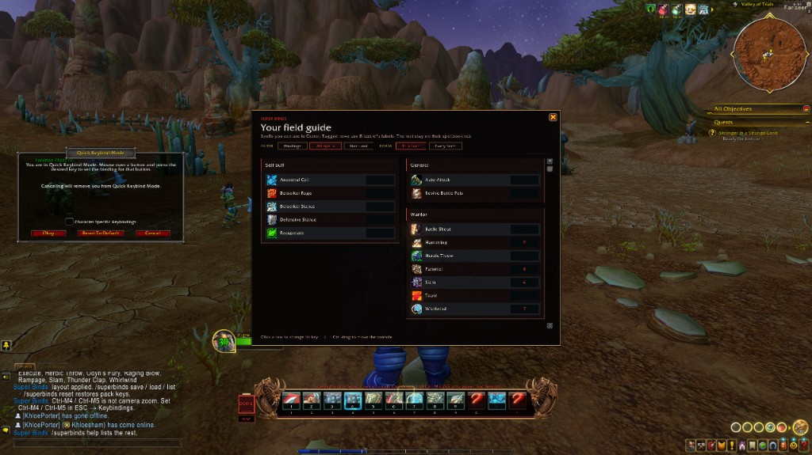
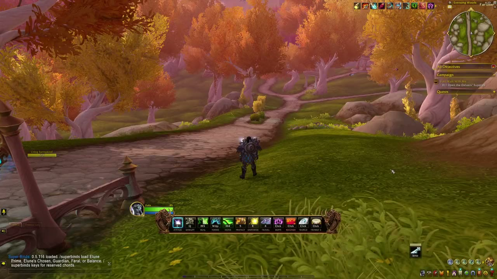
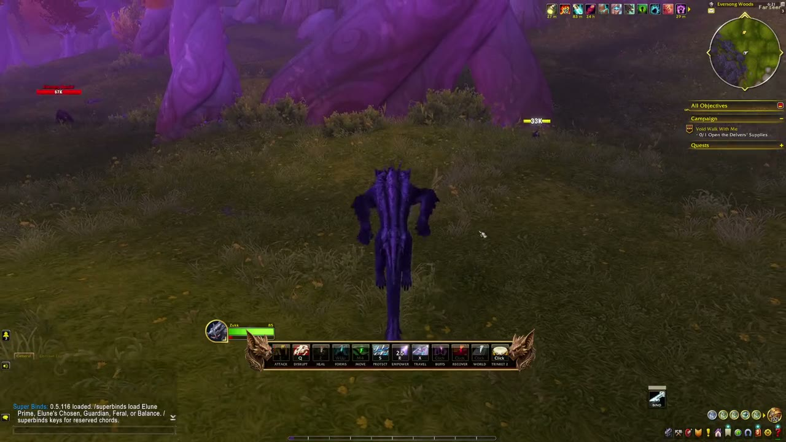
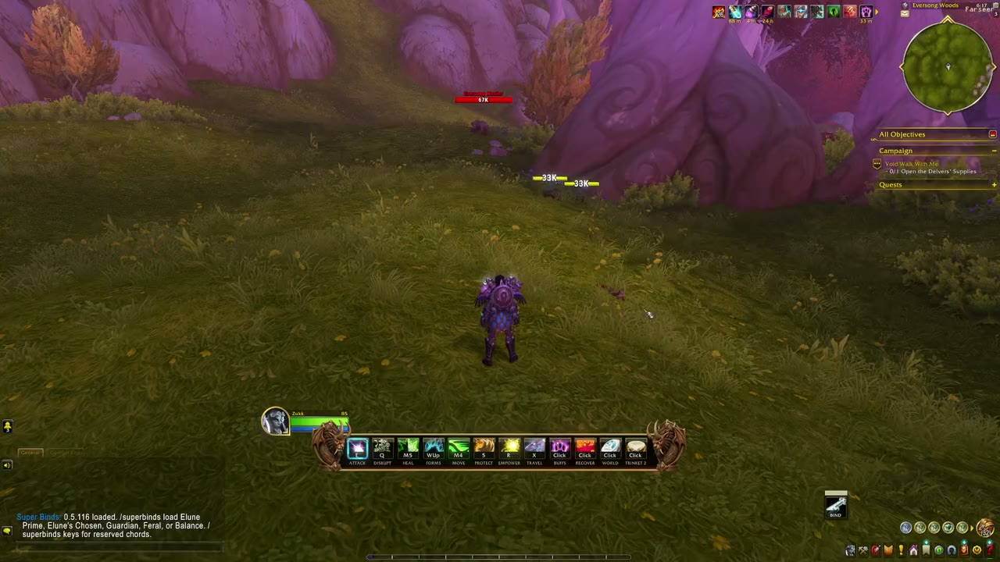
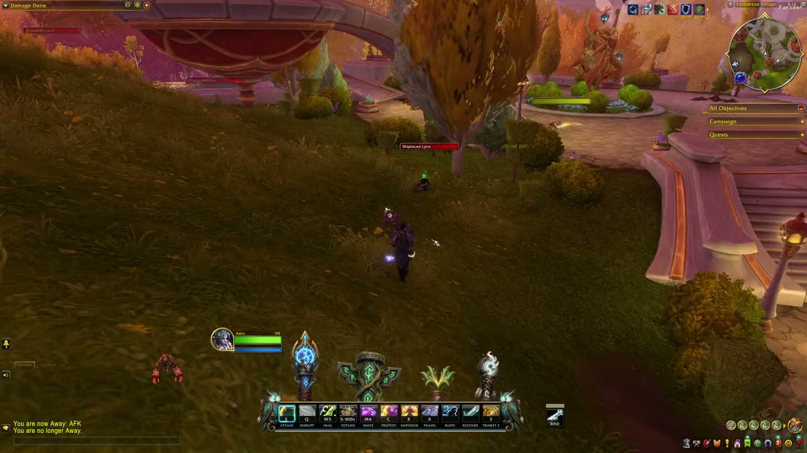

# Super Binds

Class-agnostic Midnight action console. **One bar, one set of keys, a different native action page per form.** **0.5.121.**

The engine is built for **every class**. Only a **Druid** layout ships. Shaman clips below are from a **different private addon** (Shaman Binds) that is **not** fully ported and is **not** what you get when you import Druid.

## First login

Install `SuperBinds` and the class addon for the character you are on (`SuperBinds_Druid`, `SuperBinds_Warrior`, and the rest) as sibling folders under `Interface/AddOns`, then restart the client once. A setup card previews the bar and asks you to Apply on that character only. Apply hides Blizzard bars 2–8. A class with no shipped spells keeps whatever is already on action bar 1. Other characters are left alone until they Apply too. `/superbinds tutorial` shows the card again.

After Apply, two callouts sit on the real bar. The first is the buttons. The second is BIND, and MAP under it.

MAP opens the field guide. Click a row and Quick Keybind Mode starts, so you can hover that row and press a key. The Blizzard window sits on the left.

## Parked — read this first

I am stopping WoW. This addon was written **with AI**. I could not afford frontier models, so a lot of the Lua is the kind of thing people call AI slop. Sorry. It has **not** been tested hard. **Expect bugs**, empty faces, weird binds, and leftover experiments.

If you do not want an AI-assisted addon, skip it. If you do, fork it and make it better — no permission needed.

**Shaman totem timers / ultimates in the old footage are not SuperBinds.** That was a private, shaman-only prototype. SuperBinds is the class-agnostic rewrite. Druid is the one filled-in pack.

## Start clean (reset)

Do not copy someone else's SavedVariables. Start from stock:

1. **Close WoW.** Never delete WTF while the game is running.
2. Delete `WTF/Account/<your account>/SavedVariables/SuperBinds.lua` and `SuperBinds.lua.bak` if they exist.
3. Install this folder as `_retail_/Interface/AddOns/SuperBinds`, and `SuperBinds_Druid` beside it. The Druid addon loads when the core loads. Restart the client once so WoW sees the new folder.
4. Log in on a **Druid**. Disable **Shaman Binds** on that character if both are installed.
5. `/reload`. Then either:
   - ESC → Options → AddOns → **Super Binds** → **Start clean** → **Import Druid layout**, or
   - Out of combat: `/superbinds clean`

That wipes overlays, per-form slot memory, BIND chords, drawers, and console position, then loads the one shipped Druid pack (**Elune Prime**). `/superbinds reset` only restores pack keys and is not a full wipe.

**Adding and moving spells** — BIND, drawers, and dropping abilities onto faces. Each form keeps its own slot memory (unshifted vs cat, bear, travel, and so on).

**Haranir bat form** — same keys, bat-form page and endcap.

**0.5.116** — Haranir Druid: every form bar, hotkey helper, GCD attack helper, and the cat attack helper. Blizzard’s assisted rotation omits bleeds, so they do not stack from that helper.

**Shaman Binds origin (WIP)** — totem-pole timers, ultimate, menus and drawers. SuperBinds is the port; those timers are **not** in SuperBinds yet.

**Field guide** (`/keymap`) — bindings on the bar, or every spellbook spell. **Not used** hides spells already placed. **This form** is the default, so a cat-only spell does not show as unused while you are in bear. Crowd control, defensives, and self buffs use Blizzard’s tags. Everything else stays on its spellbook tab.

**Hotkey menu** — BIND mode. Hover an icon, press a key or scroll. Each form keeps its own slot memory.

## The bar

Same labeled keys in every stance. The **native slot under the key** is what changes (caster, cat, bear, bat form, skyriding).

More stills (cat, travel, Alliance owl): [`docs/SHOTS.md`](docs/SHOTS.md).

## Install

Junction this folder to `_retail_\Interface\AddOns\SuperBinds`. **Start clean** (above) so you are not eating leftover SavedVariables. Disable **Shaman Binds** on the Druid so both addons do not own keys and slots.

Full steps: [`docs/INSTALL.md`](docs/INSTALL.md).

## Packs

**One public import: Druid → Elune Prime** (Guardian + Elune's Chosen hero). Settings → **Import Druid layout** applies the shipped file. `/superbinds load Elune Prime` sticks until you change spec. If a saved profile uses that same name, **load** uses the save and **Import** does not.

Feral / Balance / Guardian / Elune's Chosen still exist in the TOC for spec-follow and `/superbinds list`. They are not extra “imports.” There is **no Shaman import**.

## Commands

`/superbinds` apply · `clean` wipe overlay + stock Druid · `load Elune Prime` · `save` · `list` · `bind` · `options` · `keys` · `hide` / `show`. Alias `/sbinds`. Field guide: `/keymap`.

## Since 0.5.117

**0.5.118.** Assisted Combat glow only while it has a next cast. Explicit pack rows stay even when the rotation list names them. Import Druid applies shipped Elune Prime, not a saved profile of the same name.

**0.5.119.** A pack you load stays loaded until you change spec. Elune Prime keys that were click-only: Rake **1**, Rip **4** (2 and 3 stay trinkets; skyriding still takes 1 and 2 while mounted), bear Regrowth **Shift-M5**, bear Barkskin **Ctrl-C**, Remove Corruption **Alt-M5** on Heal. Recover stays click-only: Rebirth, Revive, Moonglade, Hearthstone.

**0.5.120.** Field guide filter: Bindings, All spells, Not used, and this form or every form.

**0.5.121.** All spells and Not used pull Crowd control, Defensive, and Self buff from Blizzard’s flags. No hand-kept class or race list. Other races’ spells never appear, because the list is this character’s spellbook.

## Docs

| | |
|---|---|
| Install | [`docs/INSTALL.md`](docs/INSTALL.md) |
| Screenshots | [`docs/SHOTS.md`](docs/SHOTS.md) |
| Next-best / pulse (experimental) | [`docs/EXPERIMENTAL.md`](docs/EXPERIMENTAL.md) |
| Profile from a live probe | [`docs/PROFILE-GUIDE.md`](docs/PROFILE-GUIDE.md) |
| Schema | [`docs/PROFILE-SCHEMA.md`](docs/PROFILE-SCHEMA.md) |
| Endcap art | [`docs/ART.md`](docs/ART.md) |
| Session notes / agent traps | [`docs/NOTES.md`](docs/NOTES.md) |
| Known errors | [`docs/ISSUES.md`](docs/ISSUES.md) |
