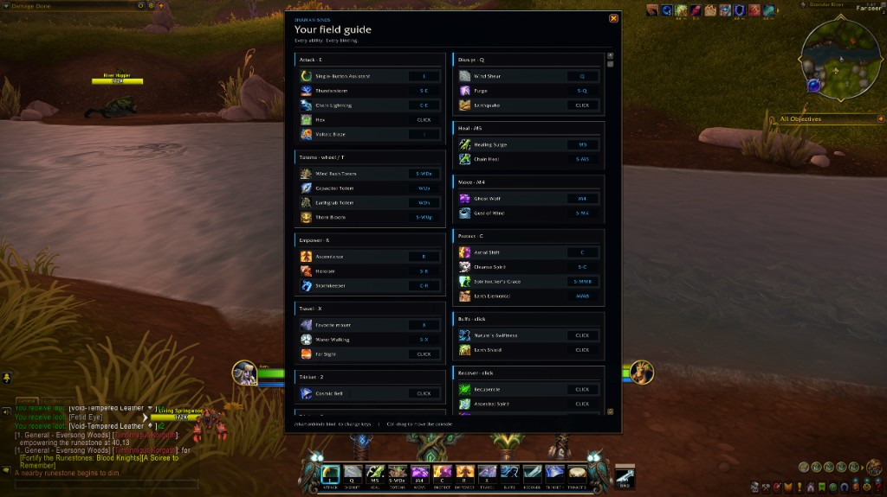
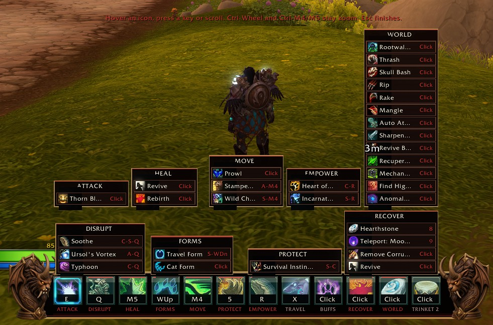
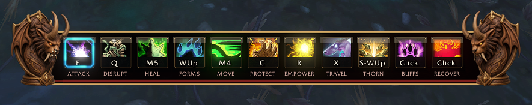
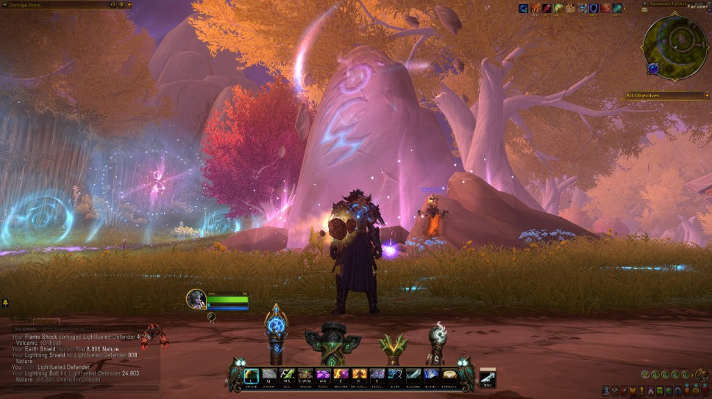
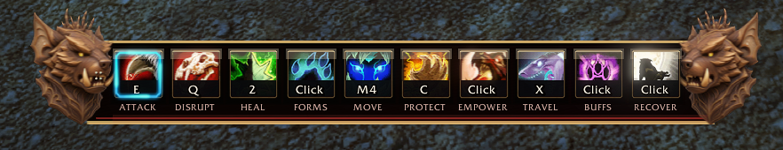
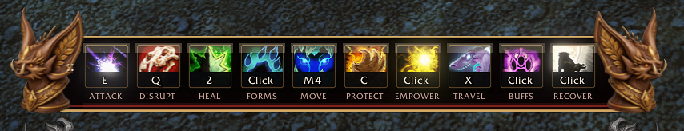
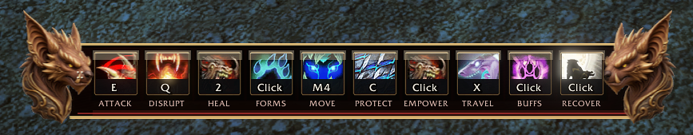
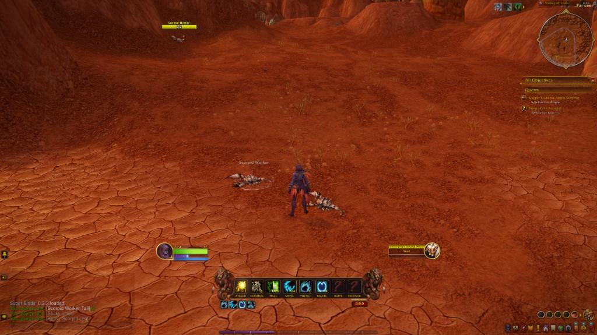

# Screenshots

In-game captures under `docs/shots/`. PNG stills plus silent MP4 demos (under 10 MB, no audio, GitHub-ready). These are the **Druid packs** on SuperBinds (Guardian / Feral / Balance) — not the Shaman Binds addon, except the origin WIP clip called out below. Same ten family tabs and keys every stance; endcaps and tab faces follow Haranir form.

Product: [`../README.md`](../README.md). Endcap files: [`ART.md`](ART.md).

## Demo

**Adding and moving spells** — BIND, drawers, dropping abilities onto faces. Each form keeps its own slot memory (unshifted vs cat, bear, travel, and so on).

https://github.com/user-attachments/assets/3cdeb784-c3e7-41b7-9bd4-6409eec09026

**Haranir bat form** — same keys, bat-form page and endcap.

https://github.com/user-attachments/assets/ca82af59-d3d5-4644-9b2f-74fd024eb204

**SuperBinds 0.5.116** — Druid so far: form bars, hotkey helper, GCD attack helper, cat attack helper. Blizzard’s assisted rotation omits bleeds, so they do not stack from that helper.

https://github.com/user-attachments/assets/d4cb291b-2684-4674-81a6-2b39eefb3a0f

**Attack helper** — the pulse that times the next attack, so you press as the swing comes ready.

https://github.com/user-attachments/assets/0554ebdd-a97d-4d26-8e2b-bad28d7c3c1f

**Shaman Binds origin (WIP)** — Haranir Druid with totem-pole timers, the ultimate, menus and drawers. Not implemented in SuperBinds yet.

https://github.com/user-attachments/assets/1eb62c11-db0c-4e98-ae85-c976e423f44c

**Field guide** (`/keymap`) — bindings, or every spell. **0.5.120** adds Not used and this-form. **0.5.121** groups crowd control, defensives, and self buffs with Blizzard’s tags.

**Hotkey menu** — BIND mode. Hover an icon, press a key or scroll. Each form keeps its own slot memory.

## Horde vs Alliance default bar

Unshifted console. Horde wind rider vs Alliance owl. Alliance is the Shaman Binds default strip.

### Horde

Horde Haranir, unshifted. Wind-rider endcaps (`DruidEndcap_horde.tga`). Families: Attack E · Disrupt Q · Heal M5 · Forms · Move M4 · Protect C · Empower R · Travel X · Thorn · Buffs · Recover.

### Alliance

Owl endcaps (`ShamanEndcap.tga`). Shaman Binds default strip: Attack E · Disrupt Q · Heal M5 · Totems · Move M4 · Protect C · Empower R · Travel X · Buffs · Recover · Trinket 1 / 2.

## Haranir Druid — form bar

Feral pack on a Horde Haranir. Families left to right: Attack E · Disrupt Q · Heal 2 · Forms · Move M4 · Protect C · Empower · Travel X · Buffs · Recover. Keyboard faces stay `ACTIONBUTTON`; the native page under them is the form bar.

### 1 — Cat

Wolverine endcaps (`DruidEndcap_cat.tga`). Cat page: Attack is Single-Button Assistant (blue assisted highlight), Disrupt is the cat interrupt, Heal / Protect / Empower follow the cat kit. Same labels as every other stance.

### 2 — Travel

Sable endcaps (`DruidEndcap_travel.tga`). Ground travel **shares the caster bar** (`use="caster"`), so Attack / Disrupt stay Moonfire / Roots while the sculpture switches. Skyriding flight form is the same shapeshift on bonus 5: console stays, default bar hides, E/Q/C/1/2 are the skyriding verbs, Forms wheel still changes forms. Shapeshift itself is a Forms-family key, never a next-cast.

### 3 — Default (Horde, unshifted)

Wind-rider endcaps (`DruidEndcap_horde.tga`). Caster page 1: Moonfire on E, Entangling Roots on Q. Form art is off until a shapeshift.

### 4 — Bear

Quill-bear endcaps (`DruidEndcap_bear.tga`). Shot not in this set yet — drop an in-game crop of the bar in bear and it goes here as `shots/04-haranir-bear.png`.

---

## Early development

**0.2.2**, Balance Druid, Valley of Trials. Horde wind-rider endcaps, eight family tabs, BIND. Chat: `Super Binds: 0.2.2 loaded.`

